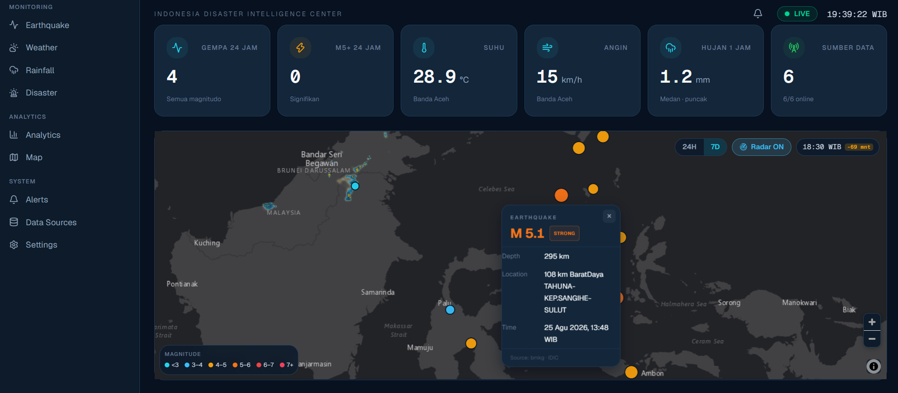
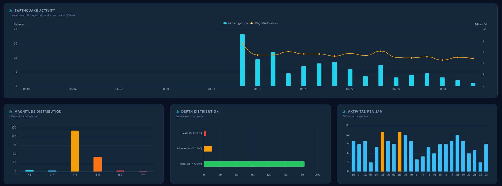
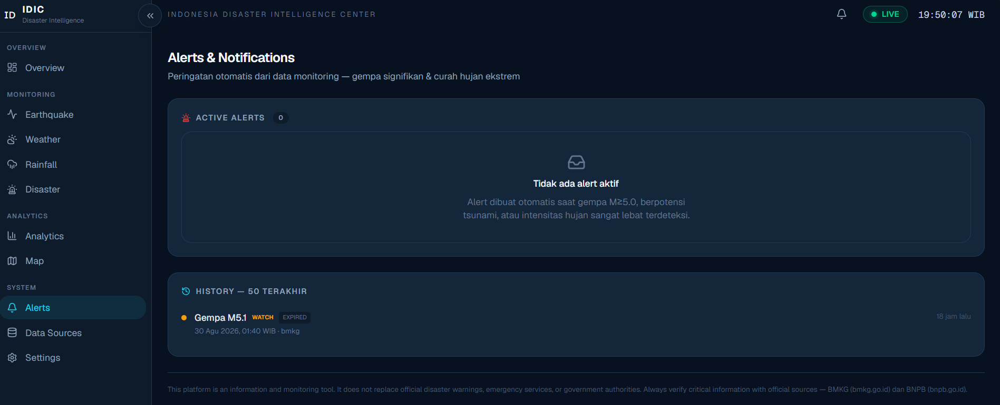

# ID Indonesia Disaster Intelligence Center (IDIC)

> **Real-Time Intelligence for Weather, Earthquake & Disaster Monitoring**

Platform monitoring bencana Indonesia _full-stack_ yang menyediakan intelijen _real-time_ untuk gempa bumi (BMKG/USGS), cuaca & curah hujan (Open-Meteo), serta analisis situasi berbasis AI — disajikan dalam antarmuka _dark-mode_ bergaya _command center_.


[](LICENSE)

---

## 📸 Dokumentasi

###  Overview Dashboard

Peta interaktif dengan marker gempa realtime, KPI cards, dan daftar aktivitas seismik.

*(Tambahkan screenshot Anda di folder `assets/`)*



### 📊 Analytics & Trends

Visualisasi data historis menggunakan ECharts: tren gempa, distribusi kedalaman, dan kondisi cuaca.



### 🚨 Alert & Notification System

Sistem peringatan otomatis dengan banner kritis dan notifikasi browser (opt-in).



---

## ✨ Fitur Utama

- 🌋 **Earthquake Realtime:** Integrasi data BMKG & USGS dengan marker interaktif, _ripple animation_, clustering, dan detail popup.
- 🌦️ **Weather Monitoring:** Data cuaca dari 16 kota utama Indonesia dengan animasi kondisi cuaca dinamis dan sorting.
- 🌧️ **Rainfall & Radar:** Intensitas hujan 6 level, tren 24/48/72 jam, dan lapisan radar animasi dari RainViewer.
- 🗺️ **Interactive Map:** MapLibre GL JS dengan basemap gelap dan sistem _ladder fallback_ otomatis.
- 🚨 **Automated Alerts:** Deteksi otomatis gempa M≥5.0, potensi tsunami, dan hujan ekstrem → Notification Center & Browser Notification.
- ⚡ **Realtime SSE:** Event bus → Server-Sent Events → update data tanpa reload, dilengkapi _auto-reconnect_ + _resync_.
-  **AI Situation Analysis:** Risk score deterministik + narasi LLM (Mock/Gemini/OpenAI via environment variable) untuk analisis situasi terpadu.
- 📊 **Historical Analytics:** Agregasi harian (WIB) untuk tren gempa, distribusi kedalaman, suhu, dan curah hujan.
-  **Data Source Transparency:** Status _real-time_ untuk setiap sumber data (latency, uptime, attribution).
- 📥 **Data Export:** Unduh data monitoring dalam format CSV (Excel-friendly, waktu WIB) atau JSON.

---

## 🛠️ Tech Stack

### Frontend

- **Framework:** Next.js 15 (App Router)
- **Language:** TypeScript
- **Styling:** Tailwind CSS
- **State Management:** Zustand, TanStack Query
- **Visualization:** MapLibre GL JS, ECharts
- **Testing:** Vitest, React Testing Library

### Backend

- **Framework:** FastAPI (Python 3.12)
- **Database:** PostgreSQL 16 (via SQLAlchemy + Asyncpg)
- **Cache & Pub/Sub:** Redis
- **Task Scheduling:** APScheduler
- **AI Integration:** Mock / Gemini / OpenAI
- **Testing:** Pytest, HTTPX

---

## 🏗️ Arsitektur Sistem

```mermaid
graph TD
    A[Data Sources: BMKG, USGS, Open-Meteo, RainViewer] -->|HTTPX Async| B(Provider Adapters)
    B --> C[Normalizer & Validator Pydantic]
    C --> D[Deduplication 2-Layer]
    D --> E[(PostgreSQL History)]
    D --> F[(Redis Cache)]
    E --> G[FastAPI REST + SSE]
    F --> G
    I[APScheduler Collector 60s/5m/10m] -->|Trigger| B
    G -->|Real-time Updates| H[Next.js 15 Frontend]

    subgraph Frontend
        H --> J[TanStack Query + Zustand]
        H --> K[MapLibre + ECharts]
    end

## 🚀 Quickstart
Prasyarat
-Node.js 20+ & npm
-Python 3.12+ & pip
-Docker & Docker Compose (untuk deployment penuh)

Opsi 1:Development Lokal (tanpa Docker untuk app)

# 1. Infrastrukturdocker compose up -d postgres redis#

2. Backend (terminal 1)cd backendpython -m venv venv && venv\Scripts\activate # Windowspip install -r requirements.txtcopy .env.example .env # DATABASE_URL → 127.0.0.1alembic upgrade headpython scripts/seed.pyuvicorn app.main:app --reload --port 8000# 3. Frontend (terminal 2)cd frontendnpm installcopy .env.local.example .env.localnpm run dev # http://localhost:3000

Full Stack via Docker
cp .env.example .envdocker compose up -d --builddocker compose ps # semua (healthy)# → http://localhost:3000
Backend otomatis: migrate → seed lokasi & data sources → jalankan collector.

## 🔧 Environment Variables

| Variable | Default | Keterangan |
| :--- | :--- | :--- |
| `DATABASE_URL` | `postgresql://127.0.0.1` | **Dalam Docker:** `postgresql://postgres:5432` |
| `REDIS_URL` | `redis://127.0.0.1` | **Dalam Docker:** `redis://redis:6379/0` |
| `CORS_ORIGINS` | `http://localhost:3000` | Koma-separated; regex localhost bebas di mode dev |
| `DATA_MODE` | `live` | `mock` = data tiruan berlabel (untuk dev offline) |
| `AI_PROVIDER` | `mock` | `gemini` / `openai` + API key env masing-masing |
| `NEXT_PUBLIC_API_BASE_URL`| `http://localhost:8000` | URL publik backend (di-bake saat build-time frontend) |
| `ENVIRONMENT` | `development` | `production` = fail-fast + CORS ketat |

---

## 📡 API Reference (Prefix: `/api/v1`)

| Endpoint | Fungsi |
| :--- | :--- |
| `GET /earthquakes`, `/latest`, `/stats` | Query, cache, dan agregat data gempa |
| `GET /weather`, `/current` | Observasi cuaca per lokasi |
| `GET /rainfall`, `/current`, `/history` | Data curah hujan + time series |
| `GET /alerts`, `/history` | Alert aktif & riwayat notifikasi |
| `GET /analytics/{eq, rain, weather}` | Agregasi harian WIB (cache 15 menit) |
| `POST /ai/analyze` | Situation analysis (`?force=true` untuk bypass cache) |
| `GET /sources`, `/health` | Transparency status & monitoring infrastruktur |
| `GET /stream` | Server-Sent Events (heartbeat 25s) |

## 📦 Format Respons Konsisten

Semua endpoint mengembalikan format *envelope* yang seragam untuk memudahkan parsing di frontend:

**✅ Sukses:**
```json
{
  "success": true,
  "timestamp": "2023-10-27T10:00:00Z",
  "source": "database",
  "data": { ... }
}

## 🧪 Testing

# Backend — 81 tests (Docker infra menyala)cd backend && pytest -q# Frontend — 41 testscd frontend && npm test

## 📦 Deployment Notes
ENVIRONMENT=production — backend fail-fast bila DB/Redis down
Ganti POSTGRES_PASSWORD; jangan commit .env
NEXT_PUBLIC_API_BASE_URL = URL publik backend (mis. https://api.domain.com)
CORS_ORIGINS = domain frontend produksi
SSE: disable buffering bila di belakang nginx (X-Accel-Buffering: no sudah dikirim)
Setelah image jalan, verifikasi: GET /api/v1/health → semua komponen ok
Roadmap: rate limiting produksi, PostGIS query nearby, provider flood/landslide resmi saat tersedia, AI provider key rotasi otomatis.

## ⚠️ Disclaimer
PENTING: Platform ini adalah alat bantu monitoring dan visualisasi data.
-BUKAN sistem peringatan resmi pemerintah.
-BUKAN pengganti informasi dari layanan darurat atau   otoritas pemerintah.
-Kategori magnitudo & risk score adalah klasifikasi internal aplikasi untuk tujuan monitoring.
Selalu verifikasi informasi kritis melalui saluran resmi:
-BMKG
-BNPB

🙏 Data & Attribution
-BMKG TEWS — gempa realtime resmi Indonesia
-USGS FDSN — feed seismik internasional
-Open-Meteo — cuaca & presipitasi
-RainViewer — mosaik radar hujan
-Basemap © OpenStreetMap contributors © CARTO
````

## 📄 License

Distributed under the MIT License. See LICENSE for more information.

## 👨‍💻 Author

A-Salim
GitHub: **[salim-arch]**
Project Link: **[indonesia-disaster-intelligence-center]**
